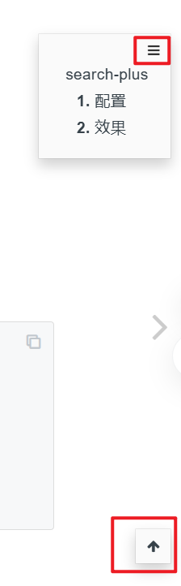

# anchor-navigation-ex

添加悬浮目录和至顶按钮

## 配置

```json
{
    "plugins": [
        "anchor-navigation-ex@1.0.14"
      ],

    "pluginsConfig": {
        "anchor-navigation-ex": {
            "showLevel": true,
            "associatedWithSummary": true,
            "printLog": false,
            "multipleH1": false,
            "mode": "float",
            "showGoTop":true,
            "float": {
                "floatIcon": "fa fa-navicon",
                "showLevelIcon": false,
                "level1Icon": "fa fa-hand-o-right",
                "level2Icon": "fa fa-hand-o-right",
                "level3Icon": "fa fa-hand-o-right"
            },
            "pageTop": {
                "showLevelIcon": false,
                "level1Icon": "fa fa-hand-o-right",
                "level2Icon": "fa fa-hand-o-right",
                "level3Icon": "fa fa-hand-o-right"
            }
        }
    }
}
```

## 效果


