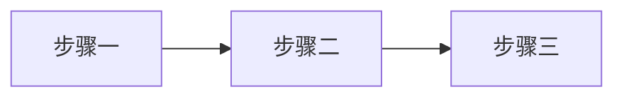

# mermaid-gb3

支持 [Mermaid](https://www.yuque.com/gendloop/learningnotes/mermaid-guide) 图表

## 配置

```json
{
    "plugins": [
        "mermaid-gb3@2.1.0"
      ]
}
```

## 效果

````markdown

```mermaid
graph LR
1[步骤一] --> 2[步骤二] --> 3[步骤三]
```
````


```mermaid
graph LR
1[步骤一] --> 2[步骤二] --> 3[步骤三]
```

